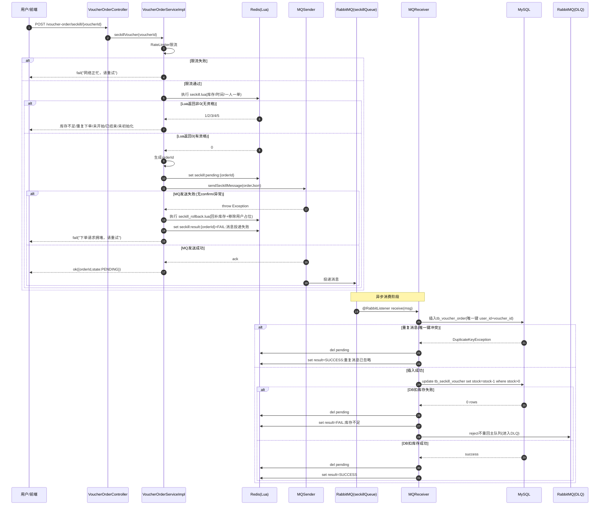
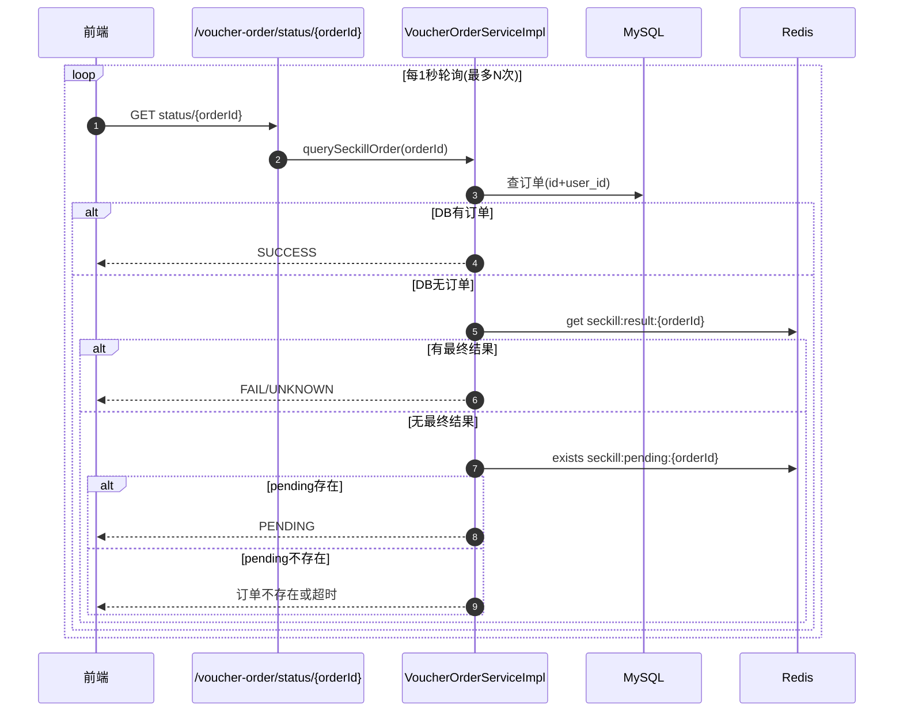

# 秒杀模块实现沉淀（当前实现）

本文档总结当前项目的秒杀模块实现、关键链路、失败分支与运维能力，便于后续维护与迭代。

## 1. 架构总览

当前实现采用：

- **Redis + Lua**：做秒杀资格原子校验（时间窗、库存、一人一单）
- **RabbitMQ 异步下单**：削峰填谷，提升高并发稳定性
- **MySQL 最终落库**：订单与库存最终一致性
- **DLQ 死信队列运维**：支持查看、预演、重放
- **状态查询接口**：前端轮询 `PENDING/SUCCESS/FAIL`

---

## 2. 主链路时序图（含失败分支）

---

## 3. 状态查询时序图（前端轮询）

---

## 4. 关键 Redis Key 设计

- `seckill:stock:{voucherId}`：秒杀库存
- `seckill:begin:{voucherId}`：开始时间（epoch秒）
- `seckill:end:{voucherId}`：结束时间（epoch秒）
- `seckill:order:{voucherId}`：已下单用户集合（set）
- `seckill:pending:{orderId}`：异步处理中标记
- `seckill:result:{orderId}`：最终结果（SUCCESS/FAIL...）

说明：
- Lua 成功路径会为活动 key 设置过期时间（活动结束后 +1天），避免历史 key 长驻。
- MQ发送失败场景使用 `seckill_rollback.lua` 回滚 Redis 资格占位。

---

## 5. 数据库约束与幂等

- 订单表 `tb_voucher_order` 增加唯一约束：
  - `uk_user_voucher(user_id, voucher_id)`
- 消费端先插订单，遇到唯一键冲突视为重复消息，直接幂等返回。

---

## 6. MQ 配置与可靠性

- 发送端：
  - 开启 publisher confirm / returns / mandatory
  - 发送时等待 broker ack
- 消费端：
  - 库存不足等不可重试异常 `reject and dont requeue`
  - 路由到 DLQ，避免无限重试风暴
- 队列拓扑：
  - 主队列：`seckillQueue`
  - 主交换机：`seckillExchange`
  - 死信交换机：`seckillDlxExchange`
  - 死信队列：`seckillQueue.dlq`

---

## 7. 管理端 DLQ 运维能力

### 7.1 查询死信

- `GET /admin/seckill/dlq?limit=20&voucherId={可选}`
- 支持按 voucherId 过滤

### 7.2 预演重放（Dry-run）

- `POST /admin/seckill/dlq/replay/preview?limit=20&voucherId={可选}`
- 仅扫描统计，不实际重放
- 返回：`requested/canReplay/scanned/remaining/sampleOrderIds`

### 7.3 真实重放

- `POST /admin/seckill/dlq/replay?limit=20&voucherId={可选}`
- 支持按 voucherId 精确重放
- 返回：`replayed/failed/scanned/remaining/replayedOrderIds`

### 7.4 审计

- 预演与重放均有 `@AdminActionLog` 记录
- 日志 detail 中包含 method/uri/query/resultData 等上下文

---

## 8. 前端交互（秒杀页）

- 点击“立即抢购”后，先收到 `PENDING`
- 前端轮询 `/voucher-order/status/{orderId}`
- 根据状态更新文案：
  - `PENDING`：排队中
  - `SUCCESS`：下单成功
  - `FAIL`：下单失败（带原因）

后台“秒杀死信”页面支持：
- 查看积压
- 预演重放
- 重放确认弹窗
- 样本订单号一键复制

---

## 9. 主要实现文件索引

### 后端

- `src/main/java/com/hmdp/service/impl/VoucherOrderServiceImpl.java`
- `src/main/resources/seckill.lua`
- `src/main/resources/seckill_rollback.lua`
- `src/main/java/com/hmdp/rebbitmq/MQSender.java`
- `src/main/java/com/hmdp/rebbitmq/MQReceiver.java`
- `src/main/java/com/hmdp/config/RabbitMQTopicConfig.java`
- `src/main/java/com/hmdp/controller/VoucherOrderController.java`
- `src/main/java/com/hmdp/controller/AdminSeckillController.java`
- `src/main/java/com/hmdp/aspect/AdminActionLogAspect.java`

### 前端

- `frontend/src/pages/ShopDetailPage.tsx`
- `frontend/src/pages/admin/AdminSeckillDlqPage.tsx`
- `frontend/src/services/modules/voucher.ts`
- `frontend/src/services/modules/admin.ts`
- `frontend/src/services/types.ts`

---

## 10. 现状与后续建议（可选）

- 当前 `RateLimiter` 为单机限流；多实例可考虑网关级限流 + 分布式限流。
- 可增加“重放任务批次号”，用于更强的回溯与审计。
- 可增加“自动对账任务”（Redis库存 vs DB库存）用于巡检。

